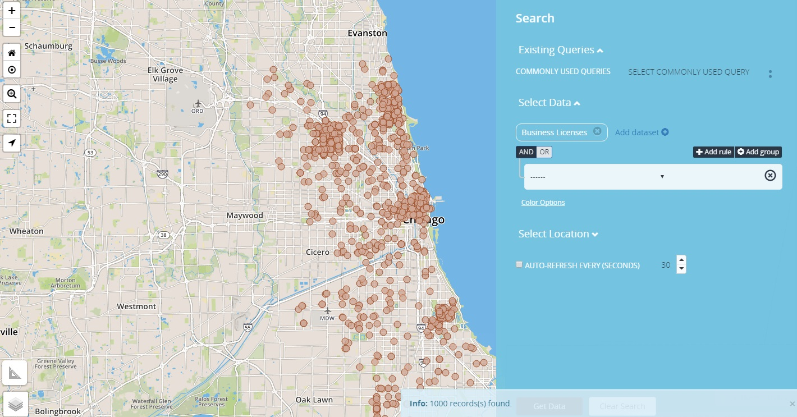
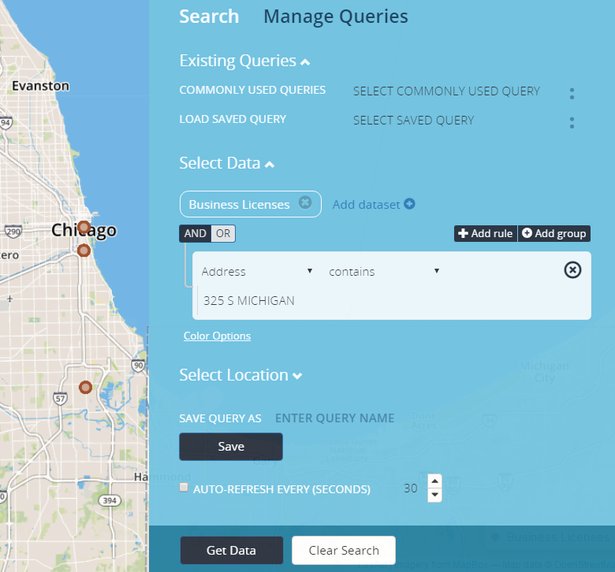
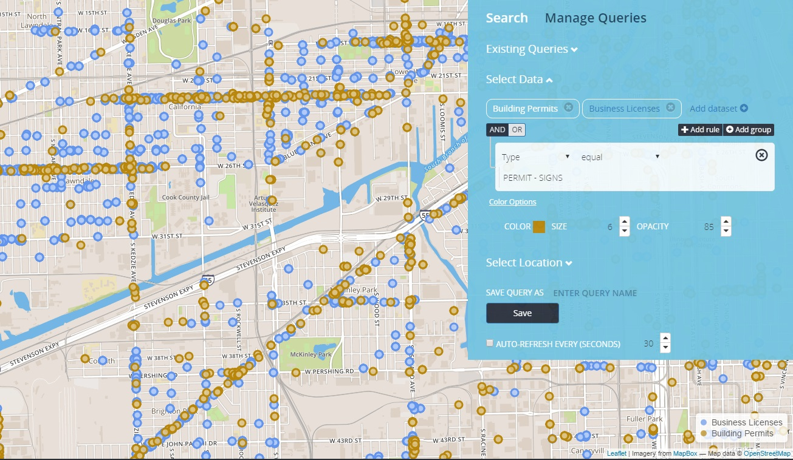

# Getting Started

1. In Select Data – Select the Add Dataset Link.

2. A drop list of available datasets appears, select the appropriate Dataset.

3. Parameter box appears with and/or operator as connectors.

4. Identify the parameters from the drop list.

5. Add location boundary (Select Location Section), if needed.

6. Execute the search, select "Get Data".

WindyGrid will search for data within the map. Move the map or change the zoom to update the search.

## Search Examples

### Single Search With No Specification

Search that displays a single data-set with no parameters returns all information pertaining to that data-set. Maximum results displayed on the page is 1000.

<b>No Filter Search</b>

### Single Search by Address

Search that is based off Address Only. Return all data pertaining to that address.

<b>Address Search</b>

### Single Search With Multiple Parameters

A user may want to run multiple Business Licenses criteria in a single search for comparison purposes. Using food establishments as an example, a user can search for restaurants and food trucks in Chicago, the two search criteria are listed under a single dataset, called Business Licenses.

What should a user do since there is a one-color limitation and default color per dataset setup?

Add Business Licenses dataset twice, set one with a filter of license_description = “Retail Food Establishment” and the other of license_description = “Mobile Food License”.  

Datasets are assigned a specific color point that plots on the map to represent each dataset, since we are applying the same dataset twice with different parameters for each subset the color of the dataset will be the same which would make it hard for a user the differentiate between the filtered datasets.

To differentiate the data points for an individual dataset with multiple filters assign each dataset a different color by selecting the “Color Option” link beneath search window.

The example below displays how the search setup and each data type is represented on the grid...Retail Food Establishments has the default color of Blue and Mobile Food Licenses is Red.

<b>Single Search With Multiple Parameters</b>

###  Multiple Search With Single Parameter

Multiple data searches can be queried simultaneously returning multiple results on the grid. Repeat twice, select Add dataset link, apply single parameter and execute the search.

<b>Multiple Search With Single Parameters</b>

## Find Data Panel

<b>Find Data Panel</b>

<table>
    <tr>
        <th>
            <b>Panel No.</b>
        </th>
        <th>
            <b>Panel Description</b>
        </th>
    </tr>
    <tr>
        <td>
            1.
        </td>
        <td>
             Search Link, displays the search panel.
        </td>
    </tr>
        <tr>
        <td>
            2.
        </td>
        <td>
             Existing Queries is a collapsible link that displays "Commonly Used Searches".
        </td>
    </tr>
    <tr>
        <td>
            3.
        </td>
        <td>
            Commonly Used Queries are predefined searches that end users utilize to search around the chicagoland area.
        </td>
    </tr>
    <tr>
        <td>
            4.
        </td> 
        <td>
            Select Data, is a collapsible link that is used to run advanced searches within the find data panel.    
            It has an <b>"Add Dataset"</b> link; that is used to start the process of creating a search, when selected it displays a                 droplist of available city datasets. 
	
 When a dataset is selected an additional textbox appears with AND/OR operands with an additional droplist that displays the             dataset searchable datatypes. 
 There is also a color option link underneath the datatype selector search box, that 		    provides the user with the option to change the data point color, size and transparency.
        </td>
    </tr>
    <tr>
        <td>
             5.
        </td>
        <td>
            Select Location, is a collapsible link that interacts with the Search Data section of the Find Data Panel; providing geo-spatial filtering against the dataset. 
			
 There are two filter parameters within the Selection Location section called <b>"WITHIN"</b> and <b>"NEAR"</b>. 
 
			Within has a droplist of available geo spatial filterings that are used to search within a specific filter type. 
			
 Near activates the geo locator <b>(ME)</b> or marker feature <b>(MARKER)</b>. For more details see "WITHIN" and "NEAR" section later in the document. 

        </td>
    </tr>
    <tr>
        <td>
             6.
        </td>     
        <td>     
             Auto Refresh is activated when the checkbox is selected; the default timimg is 30 seconds.
        </td>
    </tr>
    <tr>
        <td>
             7.
        </td>
        <td>
            Get Data Button, executes the advanced search.
        </td>
    </tr>
    <tr>
        <td>
            8.
        </td>    
        <td>    
            Clear Search Button, resets the find data panel section.
        </td>
    </tr>
</table>
